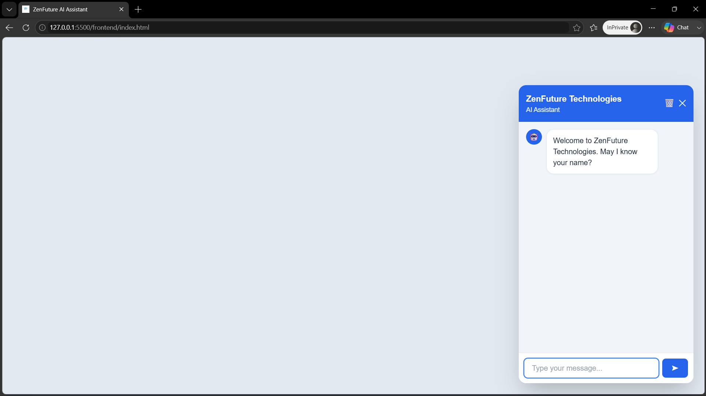
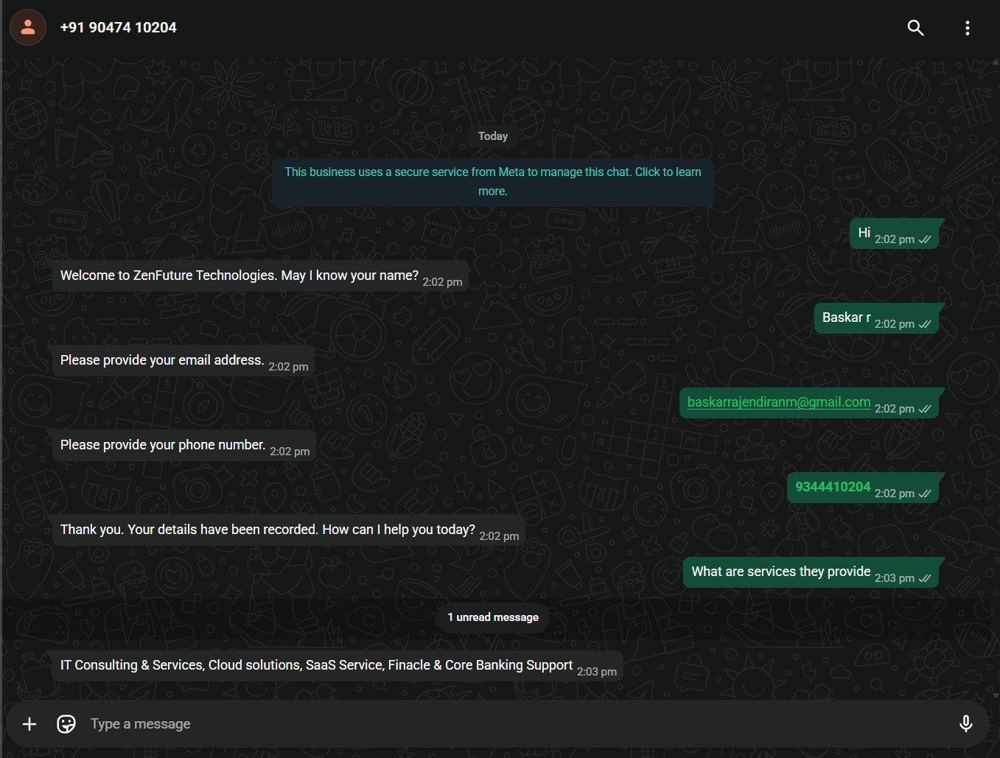

# Omnichannel RAG Chatbot

An AI-powered customer support and lead generation platform that provides a unified conversational experience across Website and WhatsApp channels using a shared Retrieval-Augmented Generation (RAG) knowledge base.

## Problem

Many businesses need AI assistants across multiple channels, but maintaining separate knowledge bases for Website Chat, WhatsApp, and other platforms creates duplication, inconsistency, and operational overhead.

This project solves that problem by providing:

* A shared knowledge base
* Unified retrieval architecture
* Lead collection workflow
* Multi-channel support
* Source attribution
* Local LLM inference

## Key Features

### Multi-Channel Support

* Website Chatbot
* WhatsApp Cloud API Integration

Both channels share:

* Retrieval pipeline
* Knowledge base
* Lead database
* Session management

---

### Lead Collection

Collects and stores:

* Name
* Email
* Phone Number

All lead information is persisted in PostgreSQL for future follow-up and analytics.

---

### Retrieval-Augmented Generation (RAG)

The system retrieves relevant information before generating responses.

Knowledge sources can include:

* Website content
* FAQs
* Documentation
* PDFs
* Internal knowledge bases

---

### Hybrid Retrieval Pipeline

The retrieval pipeline is designed to optimize both Recall and Precision.

#### Stage 1: Dense Retrieval

Uses:

* BAAI BGE Embeddings
* Qdrant Vector Database

Purpose:

* Semantic search
* Meaning-based matching

#### Stage 2: BM25 Retrieval

Purpose:

* Exact keyword matching
* Acronyms
* Product names
* Domain-specific terminology

#### Stage 3: Reciprocal Rank Fusion (RRF)

Combines Dense Retrieval and BM25 results.

Purpose:

* Improve Recall
* Reduce retrieval blind spots

#### Stage 4: CrossEncoder Reranking

Uses:

* MS MARCO CrossEncoder

Purpose:

* Improve Precision
* Select the most relevant chunks before generation

### Retrieval Philosophy

Recall First

Retrieve enough potentially relevant information.

Precision Second

Use reranking to remove noise before sending context to the LLM.

---

## Architecture

```text
User
│
├── Website Chat
│
└── WhatsApp
        │
        ▼
FastAPI Backend
        │
        ▼
Lead Collection
Session Management
        │
        ▼
Hybrid Retrieval

├── Dense Search (Qdrant)
├── BM25 Search
└── Rank Fusion

        │
        ▼
CrossEncoder Reranker
        │
        ▼
Llama 3.2
        │
        ▼
Response Generation
        │
        ▼
PostgreSQL Storage
```

## Technology Stack

### Backend

* Python
* FastAPI

### Database

* PostgreSQL

### Vector Database

* Qdrant

### AI Components

* Llama 3.2
* BAAI BGE Embeddings
* BM25 Retrieval
* Reciprocal Rank Fusion
* CrossEncoder Reranker

### Messaging

* WhatsApp Cloud API

### Deployment

* Docker
* Docker Compose

---

## Screenshots

### Website Chatbot



### WhatsApp Chatbot



---

## Project Structure

```text
app/
├── api/
├── core/
├── db/
├── models/
├── prompts/
├── providers/
│   ├── embeddings/
│   ├── llm/
│   └── rerankers/
├── rag/
├── repositories/
├── schemas/
├── services/
└── main.py

scripts/
├── test_bm25.py
├── test_hybrid.py
├── test_hybrid_rerank.py
├── test_rank_fusion.py
└── test_whatsapp.py
```

## Setup

### Clone Repository

```bash
git clone https://github.com/Baskar-forever/omnichannel-rag-chatbot.git

cd omnichannel-rag-chatbot
```

### Configure Environment Variables

```env
DATABASE_URL=

QDRANT_HOST=
QDRANT_PORT=

WHATSAPP_ACCESS_TOKEN=
WHATSAPP_PHONE_ID=

LLM_MODEL=
```

### Start Services

```bash
docker compose up -d
```

### Initialize Database

```bash
python init_db.py
```

### Run Application

```bash
uvicorn app.main:app --reload
```

---

## WhatsApp Integration

1. Create Meta Developer App
2. Enable WhatsApp Cloud API
3. Configure Webhook URL
4. Configure Verify Token
5. Add Access Token and Phone Number ID

Webhook Endpoint:

```text
/api/whatsapp/webhook
```

---

## Reliability Features

### WhatsApp Message Deduplication

Stores processed WhatsApp Message IDs to prevent duplicate responses caused by webhook retries.

### Session Persistence

Conversation state is stored in PostgreSQL allowing users to continue conversations across requests.

### Source Attribution

Responses include source references used during retrieval.

---

## Future Improvements

* Evaluation Pipeline
* Retrieval Metrics Dashboard
* Automated Knowledge Base Updates
* Conversation Analytics
* Multi-Tenant Support
* Additional Communication Channels

---

## License

MIT License

---

Originally developed as a technical assessment and later generalized into a reusable Omnichannel RAG Chatbot framework.
